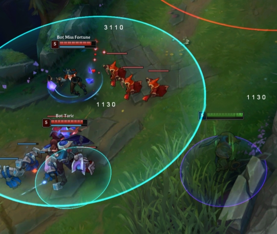

# LoL Patcher

LoL Patcher is an old game mod designed for League of Legends. It's primarily
for educational purposes, created to explore and understand how certain cheat
mechanisms work. This tool has not been updated since February 2020 and was made
purely for experimentation and fun.

Technical Details:

- Injects itself into the game like shellcode (no PE headers, no standard libraries used)
- Memory scanning is performed externally by the injector
- Hooks the Direct3D C++ Virtual Table to display information on the screen
- Uses Return-Oriented Programming (ROP) to manipulate function return addresses
- Includes compile-time encryption for added obfuscation

Features:

- ESP (Extrasensory Perception) for characters and objects
- Last Hit Helper to assist in farming
- Displays skill level and cooldown indicators


## Screenshot




# Building

On Ubuntu:

```sh
apt install mingw-w64 nasm
make
```